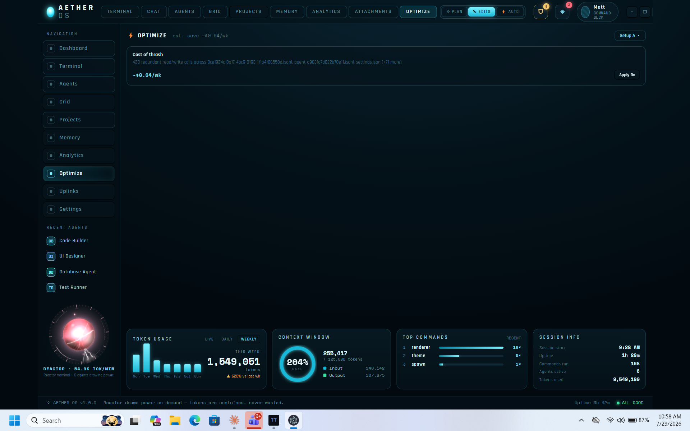
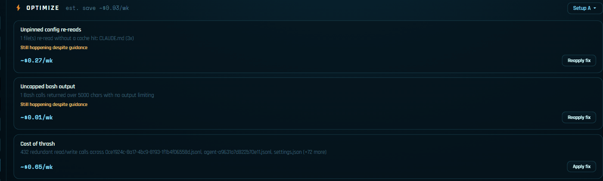

# Aether OS

**A diagnostic instrument for Claude Code.** Most tools in this space answer *how much did I
spend*. Aether OS answers a harder question: **is the agent actually working, or is it
thrashing** — and it tells you on an ambient reactor display you notice from across the room,
before you think to look.

It runs as an Electron desktop app: a real `claude` CLI session, live tracking of your actual
Claude Code usage and subagent dispatches, behavioral anomaly detection over that stream, and a
Comms deck where the mission-control intelligence (AETHER) and every agent reply through a local,
deterministic responder — no model call, no API key, no way for this app to place a paid API call
at all (Stage 13.5; see `docs/roadmap.md` §3.5).

One honest line up front: **this started as a simulation and has been migrated to live data.**
The original build ran on fictitious information by design — a deterministic tick fed synthetic
agents, token burn, and log noise so every view could be built and tested against predictable
state. That scaffolding has since been replaced, phase by phase, with the real thing. The
reactor's pulse is your real token burn rate and dispatch concurrency; the terminal is a real
`claude` CLI session; the agent roster shows genuinely-running subagent dispatches. The remaining
sim pieces exist only where noted, and `PROGRESS.md` tracks exactly which is which — including
known issues and genuinely-blocked items, not just wins.


*Optimize surfacing a genuine "cost of thrash" finding — 428 redundant read/write calls detected
live across real session transcripts, priced at ~$0.64/wk, with a one-click fix. Not mocked data.*


*The thesis, live: a file re-read three times without a cache hit gets caught, named
(`CLAUDE.md (3x)`), and priced (~$0.27/wk) in real time — the same detector that once only
existed as `anomalyDetectors.ts` unit tests, now visibly catching a real one.*

---

## What makes this different

Four things here you won't find in the other Claude Code dashboards. They're the reason this
repo exists.

### Behavioral anomaly detection, not just cost accounting

`src/shared/anomalyDetectors.ts` watches the live dispatch stream for four failure signatures:

| Detector | Catches |
|---|---|
| `detectReReadLoop` | The agent reading the same file over and over without editing it |
| `detectWriteDeleteRewrite` | Write → delete → rewrite churn on one path |
| `detectZeroEditBurn` | High burn with zero edits to show for it |
| `detectStalledPermission` | A tool call open far past the point it should have closed |

Every usage dashboard in this space tells you what you spent. Almost none tell you the agent is
stuck in a loop *right now*. Detected anomalies raise a dashed warning ring around the offending
node in the Orchestration Grid and drive an amber reactor flicker, independent of the
budget-driven alarm tiers.

*Honest limitation:* `detectStalledPermission` is currently a >60s open-tool-call heuristic and
can false-positive on legitimately slow tools. The fix is planned — see
`docs/diagnostic-thesis-plan.md`.

### No model call site for Aether's own features, enforced by a test — with one named exception

As of Stage 13.5 (2026-08-05), Aether OS contains no model call site of any kind for its own
features: the `@anthropic-ai/sdk` dependency is gone from `package.json`, every chat-model call path
(`chatCore.ts`, `claudeClient.ts`, `systemPrompt.ts`, the Vite chat proxy) is deleted, and `.env`
key loading is gone too. `src/shared/noApiCalls.test.ts` fails the build if the SDK reappears, if
any source file references `api.anthropic.com`, or if a `messages.create(` call site reappears —
not a convention, a failing test.

This replaces an earlier least-privilege-context design (a per-channel scoped snapshot, tested to
never leak the fleet roster or approval queue to an individual agent's chat) that governed the one
path where data used to leave the machine. That design and its tests are retired along with the
model call path they scoped — there's no longer a boundary to enforce because there's no longer a
path across it. Comms (formerly Chat) now answers every message through `localResponder.ts`, a
local, deterministic responder with no network request.

**One named, default-off, opt-in exception, shipped 2026-08-07:** cross-engine Codex verification
lets the operator manually ask OpenAI's Codex (over the Agent Client Protocol) whether a specific
Claude dispatch's claimed work is actually supported by its artifacts. It is off by default, requires
clicking through an explicit disclosure to enable, sends only the selected dispatch's scoped
snapshot and prompt, authenticates only through the operator's own ChatGPT account (OpenAI API keys
and custom gateways are structurally blocked, not just discouraged), and persists no raw
prompt/diff/response — see `docs/privacy-and-data.md` §9 for the full boundary and
`docs/superpowers/plans/2026-08-07-codex-acp-cross-engine-verification.md` for the implementation.

**A second, independent surface, shipped 2026-08-09 — not a new outbound-data exception:**
a Codex terminal (`electron/codexPtyManager.ts`) is a real, live `codex` CLI session alongside the
existing Claude terminal, carrying the same open-ended file/command access the Claude terminal
already has — it belongs in the same category as that terminal's own carve-out
(`docs/privacy-and-data.md` §1), not in the category above. It is off by default
(`codexTerminalCfg.enabled`, folded into the same Cross-Engine Verification settings card) and only
spawns once the operator has both enabled it and navigated to the Codex sidebar view — the same
lazy, mount-triggered pattern the Claude terminal already uses, not an unconditional app-boot
launch. It shares the verifier's dedicated `CODEX_HOME` and strips `OPENAI_API_KEY`/`CODEX_API_KEY`
from the inherited shell environment (`buildCodexPtyEnv`); like the Claude terminal's own
`ANTHROPIC_API_KEY` scrubbing, this closes the silent-inheritance path only — it cannot stop the
operator from typing an API key by hand inside the live session. See `docs/privacy-and-data.md`
§11 for the full boundary and `docs/superpowers/plans/2026-08-09-codex-terminal-view.md` for the
implementation.

### The bug that green tests couldn't see

`usageTokens()` was ported from TokenMonitor summing all four raw usage fields. It reported
~4.82 **billion** tokens a month. Claude Code's own `/usage` said ~54 million.
`cacheReadInputTokens` alone accounted for 4.68 billion.

Thirteen unit tests covered that function. **All thirteen passed**, because every fixture had the
cache fields zeroed — so the suite never once exercised the field that was wrong. It was caught by
checking the number against `/usage` on real data, not by the review pipeline.

The function now sums input + output only, with a regression test that specifically proves cache
tokens are excluded. It's documented here because a test suite that is confidently, unanimously
wrong is a more useful thing to have on record than another green badge — and because ground truth
beats coverage.

### An ambient instrument, not a dashboard you have to be looking at

Three canvas renderers (NEBULA / VOLUMETRIC / WARP, layered 2D and WebGL, hand-rolled — no chart
library) driven by real signals: burn rate, dispatch concurrency, model hue, cache-hit clarity,
concurrency turbulence, anomaly state. Backed by a synthesized alert-sound layer — yellow-alert
chirp on elevated burn, looping red-alert klaxon at the ceiling, soft chime on a new anomaly — all
generated at runtime from Web Audio oscillators, with no external audio assets.

Sound is the correct channel for something you aren't looking at, and as far as I can find, no
other tool in this category has any sound design at all.

---

## What's built

- **Projects** — real projects derived from transcript events' `cwd` values, with cost per project,
  worktrees nested under their parent repo, and an `unscoped` bucket for work in directories
  without a git context.
- **Terminal** — a real Claude Code CLI session on node-pty + xterm, replacing the original
  scripted simulation. The reactor core lives in the sidebar with a live TOK/MIN readout, its
  pulse and overload glow driven by real burn rate and real dispatch concurrency.
- **Dashboard** — session tokens, budget remaining, and depletion ETA computed from your actual
  Claude Code usage, rescanned periodically; alerts and systems cells on a single view registry.
- **Agents / Grid / Analytics** — real currently-open `Agent`-tool subagent dispatches, tracked
  live and rendered as the roster, the radial hub-and-spoke map, and the analytics views.
- **Memory** — a real Layer 2 agent-memory store (`collector/src/memoryStore.ts`): substantive
  closed dispatches are extracted into typed judgment rows (never self-reported by the agent that
  made the call), shared decisions inject unconditionally into every agent, private per-agent
  history is retrieval-ranked, and invalidation is hard-delete-plus-tombstone rather than decay —
  a reversed preference can't be cited back with the authority of a current one. The Memory view
  reads it read-only, with a scope filter and a tombstone audit view. No pinning, no strength, no
  `sweep`/`remember` — retired along with the fake data they operated on.
- **Comms** (formerly Chat) — real transcript content, not a fictional log: `electron/transcriptReader.ts`
  pulls the tail of a real session/subagent transcript on request (view mount, explicit refresh, and
  the app's existing 1s tick while a source is live — never a `state` push), rendered per-channel with
  a filter box (`transcriptFilter.ts`) and narrated through Stage 12's per-persona voice packs
  (`narrationFeed.ts`), which gives `interruptionBudget.ts` its first real consumer. Replies still come
  from `localResponder.ts`, a local, deterministic responder scoped to the AETHER channel — there is
  no model call site anywhere in the app (Stage 13.5). Transcript content is read and rendered but
  never enters the store, persistence, or disk — see `docs/privacy-and-data.md`'s render-vs-store
  amendment, enforced by `noPayloadInStore.test.ts`.
- **Ledger** — cost forensics for what this machine's Claude Code transcripts actually show: an
  exact all-transcripts total broken out by input / output / cache-write / cache-read, a dispatch
  table sorted worst-offender-first, today/week/month rollups, and the counterfactual saving the
  prompt cache is earning. Its design is mostly an argument about honesty. Totals are exact to a
  pricing table whose verification date is rendered in the footer, so it cannot quietly age into
  wrong, and every card states the window it covers — the headline figure is *all* history across
  *all* projects, not a session, and says so. Per-dispatch figures are *estimates* — the completion event carries one scalar token count
  with no input/output split — so they are a structurally different type that always renders with a
  `~` and names its basis on hover, and the gap between the exact figure and the sum of the estimates
  is displayed rather than normalized away — scoped to a single day, so the two sides actually cover
  the same window and the residual means something. A period the collector wasn't running for renders as an
  explicit gap, never as `$0.00`; zero and unknown are different answers. **What it deliberately
  does not claim:** this is what was *observed in this machine's Claude Code transcripts*, not your
  bill. Spend that never passed through a transcript is invisible here. The Ledger narrows the
  search; it does not close it.
- **Instrument + Alarm** — the anomaly-detection pipeline above surfaces as warning rings on Grid
  nodes and an amber reactor flicker; the reactor itself doubles as an instrument — model hue,
  cache-hit clarity, and concurrency turbulence are real signals, not decoration.
- **Alert Sounds** — the budget alarm and anomaly detector are audible: a synthesized (no external
  audio asset) yellow-alert chirp on elevated burn, a looping red-alert klaxon at the burn ceiling,
  and a soft chime on a new anomaly, all toggleable in Settings with a TEST SOUND preview.
- **Full light/dark theming** — every view, including the terminal's own xterm.js color theme,
  re-themes live via the Settings toggle. Grid and the reactor's WebGL/canvas rendering are the one
  deliberate exception (visual signal, not theme surface).
- Every remaining nav tab (Projects, Files/attachments, Uplinks, Settings, and friends) is a built
  view — no "coming soon" panels left.
- **Agent Memory Layer 2** — durable memory split by fact type rather than by agent: shared
  standing decisions every agent reads, private per-agent history, and a hard-delete-plus-tombstone
  invalidation path instead of decay-based forgetting, so a reversed preference can never be cited
  back at you with the authority of a current one. Shipped as roadmap Stage 13 (Phases A–D);
  retires the old `MemoryStub`. Phase E (weight tuning) is parked — needs real extraction traffic
  that doesn't exist yet. Spec in
  [`docs/superpowers/specs/AETHER_MEMORY_LAYER_2.md`](docs/superpowers/specs/AETHER_MEMORY_LAYER_2.md).

## In flight

- **Closed-loop cost optimization**, ported from [TokenMonitor](https://github.com/mwgrant21/TokenMonitor):
  detect waste → price it by counterfactual → grade the setup → apply the fix → **verify the fix
  held, and re-flag it if it recurs.**
- **The diagnostic thesis** — a per-dispatch timeline with anomaly bands and real file-touch
  tracking, cost-of-thrash attribution, and closing the loop from detection to intervention.
  Planned in `docs/diagnostic-thesis-plan.md`; the competitive research behind it is in
  `docs/competitive-gap-analysis-2026-07.md`.
- **Agent Personality Layer** — a two-pass work/narration split so each fleet agent's voice
  renders runtime-computed severity instead of self-reported tone, with a shared 0–4 severity
  scale, per-agent voice packs, and frozen phrases for high-confidence events. Phase 0 (the spine,
  Stage 11) and Phase 1 (voice packs and render, Stage 12) have shipped. **Frozen phrases are now
  reachable in production** (Stage 14, closing Stage 12's own open item): CINDER's `critic_tell`,
  ASSAY's fatal-exit `no_signal`, and STEWARD's `all_clear` all fire for real, narrated through the
  Comms deck. Two branches — PILGRIM's `empty_result` and the zero-tool-calls branch of ASSAY's
  `no_signal` — stay unreachable because the renderer only has tool-call *counts*, not per-call
  detail; the predicates are implemented and unit-tested, just never fed the data they'd need in
  production. Spec in
  [`docs/superpowers/specs/AGENT_PERSONALITY_LAYER_1.md`](docs/superpowers/specs/AGENT_PERSONALITY_LAYER_1.md).

Packaging, installers, and a team fleet view are deliberately out of scope: this is a personal
cockpit, not a distributed product. Its team-facing sibling is
[TokenMonitor](https://github.com/mwgrant21/TokenMonitor), which this project evolves.

---

## Running it

```bash
npm install
npm run electron:dev   # the real thing: desktop app, live terminal, real session tracking
npm run dev            # browser-only mode at http://localhost:5173 (no PTY / live tracking)
```

Comms (formerly Chat) answers every message through a local, deterministic responder — no API key,
no `.env`, no model call of any kind. See `docs/roadmap.md` §3.5 for the Stage 13.5 teardown that
removed the model call path.

```bash
npm test               # vitest — reducer, tick, view math, anomaly detection,
                       # alert-sound decision logic, noApiCalls capability guard
npm run build          # tsc -b && vite build
```

The frame is a fixed 1536×1024 canvas by design — a faithful port of the original design handoff —
but it scales to fit the actual viewport (`useViewportScale`/`computeFrameScale`), so it's no
longer a fixed-size-only window.

## How this is being built

The UI was designed in Claude Designer; implementation is Claude Code working through phased plan
documents in `docs/superpowers/plans/`, one fresh implementer and one fresh reviewer subagent per
task, a whole-branch review after each plan, and `PROGRESS.md` as the honest running state —
including known issues and genuinely-blocked items, not just wins. The sim-to-live migration itself
was phased the same way: Electron scaffold, real terminal, real usage data, real agent tracking,
real live output, live reactor load.

Product decisions, architecture direction, and acceptance criteria are mine; the keystrokes mostly
are not. I can explain why each piece exists, how it's meant to behave, and how it was validated —
and the `usageTokens()` story above is a fair sample of what "validated" means here: the review
pipeline passed, the number was still wrong, and checking it against reality is what caught it.
For line-level detail, the plans and commit history are the record.

## Tech

React 18 · Vite 5 · TypeScript (strict) · Electron (electron-vite) · node-pty · xterm · Vitest —
no CSS framework, no state library, no canvas library. The single `useReducer` store and
hand-rolled canvas renderers are the point.

## License

MIT — see `LICENSE` for full text.
