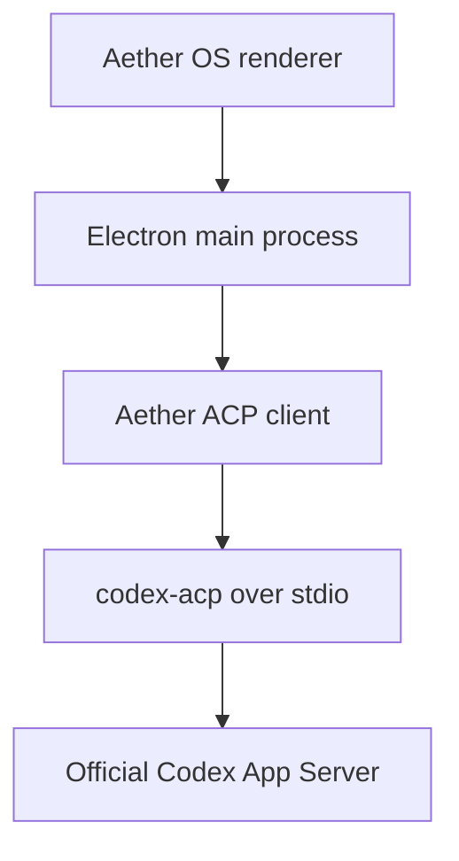

# Aether OS Codex Cross-Engine Verification

## Subscription-only ACP implementation specification

**Prepared:** 2026-08-07  
**Recommended repository destination:** `docs/superpowers/specs/2026-08-07-codex-acp-subscription-verification.md`  
**Target project:** [mwgrant21/Aether-OS](https://github.com/mwgrant21/Aether-OS)  
**Status:** implementation handoff  
**Primary constraint:** Codex verification may consume Matt's included ChatGPT/Codex allowance, but it must be structurally unable to consume OpenAI Platform API credit.

---

## Assignment to the Aether implementation agent

Implement a manually triggered Codex cross-engine verifier through an ACP client. The verifier must use ChatGPT subscription authentication only. It must never accept, inherit, read, store, proxy, or fall back to an OpenAI API key or custom model gateway.

Read these project files before changing code:

1. `docs/ideas/cross-engine-verification.md`
2. `docs/privacy-and-data.md`
3. `docs/roadmap.md`
4. `docs/superpowers/plans/2026-08-05-api-teardown-stage13.5.md`
5. `src/shared/noApiCalls.test.ts`
6. `electron/ptyManager.ts`
7. `electron/main.ts`
8. `electron/preload.ts`
9. `electron/collectorStore.ts`
10. `electron/liveAgentTracker.ts`
11. `src/state/liveAgentsMath.ts`

Use the repository's existing implementer, reviewer, whole-branch-review, test-first, and honest-documentation conventions. Do not describe the feature as free or zero-consumption. The supported claim is narrower and testable:

> Aether can use Codex through Matt's ChatGPT subscription without creating OpenAI Platform API charges. Verification still consumes the account's included Codex allowance and any ChatGPT credits Matt explicitly chooses to purchase.

---

## 1. Decision

Build this path:



The initial provider is Codex, but the Aether-facing verification service must depend on a small engine-neutral interface. Codex-specific authentication checks belong in a provider policy module, not in renderer components or the generic verifier.

Use the active [`agentclientprotocol/codex-acp`](https://github.com/agentclientprotocol/codex-acp) adapter. It starts the official Codex App Server and translates ACP requests and events. Do not use the archived `zed-industries/codex-acp` repository.

Do not call OpenAI REST endpoints directly. Do not add the general OpenAI API SDK. Do not use `npx -y` at runtime because that can download a different adapter version. Pin reviewed package versions in `package.json` and commit the lockfile.

At the time this specification was prepared, the reviewed adapter was `@agentclientprotocol/codex-acp` 1.1.14, using `@agentclientprotocol/sdk` 1.3.x and a compatible official `@openai/codex` dependency. Recheck current versions and changelogs at implementation time, then pin exact versions without a caret or tilde.

---

## 2. Non-negotiable billing contract

### 2.1 Allowed authentication

The only allowed Codex authentication status is:

```ts
type AllowedCodexAuth = {
  type: 'chat-gpt';
  email?: string;
};
```

The ACP client may send only the `chat-gpt` authentication request. Device-code ChatGPT authentication may be added later if required, but it must resolve to the same `chat-gpt` account status before a session can start.

### 2.2 Blocked authentication and routing

The following states must block verification:

- `api-key`
- `gateway`
- `unauthenticated`
- an unknown future status
- any custom `model_provider`
- any failure to prove the active authentication status

The current adapter exposes `authentication/status`. It returns `chat-gpt`, `api-key`, `gateway`, or `unauthenticated`. Aether must call it after authentication and immediately before every verification turn. Only `chat-gpt` passes.

Fail closed. A missing method, malformed reply, adapter version mismatch, timeout, or unrecognized value is not permission to continue.

### 2.3 No fallback

Aether must never perform any of these actions:

- Fall back from ChatGPT authentication to an API key.
- Offer an API-key input field.
- Expose the adapter's API-key or gateway authentication methods in the UI.
- Read `OPENAI_API_KEY` or `CODEX_API_KEY` from Aether settings, `.env`, the registry, the credential manager, or the inherited process environment.
- Route to a custom OpenAI-compatible gateway.
- Retry a quota or rate-limit failure through a different billing route.
- Purchase or enable ChatGPT credits automatically.

If included Codex usage is exhausted, show a clear unavailable state and stop. The operator decides whether to wait for reset or manually obtain more ChatGPT usage.

### 2.4 Correct language in the UI and documentation

Use:

> Uses your ChatGPT Codex allowance. OpenAI API billing is disabled.

Do not use:

> Free

> Costs nothing

> Unlimited

> Does not consume usage

OpenAI's current documentation distinguishes ChatGPT subscription access from API-key usage-based access. API-key authentication is billed through the OpenAI Platform account. ChatGPT authentication consumes the ChatGPT/Codex allowance instead.

---

## 3. Existing Aether facts and required corrections

### 3.1 What already exists

The current repository already has useful foundations:

- Stage 5 is shipped.
- Diagnostics persist anomaly rows, dispatch usage, and file-touch signal.
- The Electron main process already owns subprocess and IPC boundaries.
- `electron/ptyManager.ts` already strips Anthropic API credentials from the Claude terminal environment after the documented `$10.76/day` incident.
- `src/shared/noApiCalls.test.ts` mechanically guards against the return of direct Anthropic API call sites.
- The project is explicitly single-user and local-first.

The Codex work must extend these controls rather than remove them.

### 3.2 `last_assistant_message` is not currently persisted

The idea document predicts that Stage 5 will provide `last_assistant_message`. The shipped diagnostic schema does not currently expose it through `electron/collectorStore.ts`. This is an implementation gap, not a reason to store message content in SQLite.

Resolve the claim on demand from the existing transcript or task-notification source when the operator requests verification. Hold it only in Electron main-process memory for the duration of the verification. Do not place it in:

- collector SQLite
- the global reducer store
- persistence files
- logs
- analytics or telemetry

If the claim cannot be resolved exactly for the selected dispatch, disable verification for that dispatch and name the missing evidence. Do not substitute a guessed summary.

### 3.3 Exact per-dispatch file correlation must be proven

`DiagnosticsSnapshot.toolCalls` exposes tool-use IDs and project-relative file paths. Before implementation, prove that each touched file can be correlated exactly to the selected parent dispatch.

Do not infer ownership only from overlapping timestamps. Concurrent agents make that ambiguous.

If an exact relationship is not already available, add a content-free correlation field such as `dispatch_tool_use_id` to the diagnostic record and schema. A schema change must follow existing versioning, reader minimum-version, migration, retention, null-versus-empty, and compatibility conventions.

### 3.4 The current absolute privacy statement becomes false

`docs/privacy-and-data.md` currently says nothing leaves the machine and no model call exists. Cross-engine verification intentionally sends selected code, diffs, and instructions to OpenAI. The feature cannot ship until that document is amended.

The amendment must state:

- Cross-engine verification is the only new outbound content path.
- It is default-off.
- It requires explicit user opt-in.
- It sends only the selected verification snapshot and prompt.
- It authenticates through the user's ChatGPT account.
- It cannot use an OpenAI API key.
- Raw prompts, diffs, source files, and model responses are not persisted by Aether.
- Disabling the feature terminates the adapter and removes the active in-memory verification payload.

The README's current claims that no model call site exists and nothing can leave the machine must be revised with the same precision.

### 3.5 Do not overclaim authorship attribution

Stage 5 records current artifacts and file-touch signals, but it does not preserve a byte-for-byte repository baseline at every dispatch start. Without a baseline, Aether can answer:

> Does the current artifact support the agent's claim?

It cannot always answer:

> Did this exact dispatch create every relevant line in this diff?

Label version 1 as artifact verification, not exact authorship attribution. Exact change attribution requires either a known commit range or a baseline captured before the dispatch starts.

---

## 4. Process and credential isolation

### 4.1 Electron main owns the adapter

Spawn and manage `codex-acp` only from Electron's main process. The renderer must never receive:

- credentials
- authentication URLs before they are opened by the trusted auth flow
- raw child-process handles
- arbitrary command execution
- arbitrary working-directory selection
- arbitrary ACP method selection

Use `node:child_process.spawn` with `shell: false`, an absolute reviewed executable path, and piped stdio. ACP is JSON-RPC over stdio, so `node-pty` is not appropriate.

### 4.2 Dedicated Codex home

Use an Aether-controlled Codex home on each computer, for example:

```text
~/.aether-os/codex-home/
```

Set `CODEX_HOME` for the adapter child process. The dedicated home isolates Aether from:

- a globally configured OpenAI API key login
- custom model providers
- unrelated MCP servers
- experimental user settings
- a global `config.toml` that could silently change the billing route

The first enablement on each computer should perform a separate ChatGPT browser login. Do not copy `auth.json` between the home and office computers. Aether must not read or display the token contents.

Prefer the operating-system credential store when supported. If file-backed credentials are unavoidable, treat the file as a secret and never include it in logs, diagnostics, backups, exports, or repository content.

### 4.3 Build an allowlisted child environment

Do not start with `process.env` and remove only two keys. Construct a minimal allowlisted environment containing the operating-system variables Codex needs, then add only Aether-controlled Codex variables.

Likely OS variables include:

- `PATH` or `Path`
- `SystemRoot`, `WINDIR`, `COMSPEC`, and `PATHEXT` on Windows
- `HOME` or `USERPROFILE`
- `HOMEDRIVE` and `HOMEPATH` on Windows
- `APPDATA` and `LOCALAPPDATA` on Windows
- `TEMP`, `TMP`, and `TMPDIR`
- locale variables
- explicitly supported corporate proxy and CA variables when required

The child environment must not inherit these variables:

- `OPENAI_API_KEY`
- `CODEX_API_KEY`
- `OPENAI_BASE_URL`
- `OPENAI_ORG_ID`
- `OPENAI_PROJECT_ID`
- `MODEL_PROVIDER`
- `DEFAULT_AUTH_REQUEST`
- `CODEX_CONFIG`
- `CODEX_PATH`
- third-party gateway credentials
- cloud-provider model credentials

Set `CODEX_HOME` to the dedicated directory. Set agent mode and logging only through Aether-controlled values.

This should be a pure exported function, modeled after `buildPtyEnv()` in `electron/ptyManager.ts`, with unit tests proving every blocked variable is absent and required OS variables survive.

### 4.4 Disable unneeded capabilities

For version 1:

- Do not pass user MCP servers to the Codex session.
- Disable fast mode.
- Do not enable web search.
- Do not allow additional workspace directories.
- Do not allow the verifier to modify the real repository.
- Do not allow the adapter to select a custom provider.

The claim-versus-artifact verifier should use read-only mode. Independent test authorship may use workspace-write mode only inside the isolated temporary snapshot.

---

## 5. Proposed module boundary

Use names consistent with the current tree after inspecting it. The intended ownership is:

```text
electron/crossEngine/
  acpProcess.ts
  acpClient.ts
  codexSubscriptionPolicy.ts
  codexVerifier.ts
  dispatchEvidence.ts
  snapshotBuilder.ts
  verificationPrompt.ts
  verificationResult.ts
src/shared/
  crossEngineTypes.ts
```

Responsibilities:

| Module | Responsibility |
| --- | --- |
| `acpProcess.ts` | Resolve the pinned adapter binary, build safe environment, spawn, cap stderr, terminate cleanly |
| `acpClient.ts` | ACP initialize, authenticate, session, prompt, cancel, event routing |
| `codexSubscriptionPolicy.ts` | Permit only `chat-gpt`; perform status checks; reject API key, gateway, unknown, and fallback |
| `dispatchEvidence.ts` | Resolve exact dispatch, claim, project root, touched files, and limitations |
| `snapshotBuilder.ts` | Build and dispose isolated verification snapshot |
| `verificationPrompt.ts` | Build grounded claim-versus-artifact instructions |
| `verificationResult.ts` | Validate structured result and map failures to `inconclusive` |
| `codexVerifier.ts` | Orchestrate one verification, cancellation, timeout, cleanup, and status |
| `crossEngineTypes.ts` | Provider-neutral status, request, event, and result types |

The generic interface should resemble:

```ts
interface CrossEngineVerifier {
  probe(): Promise<VerifierStatus>;
  connect(): Promise<VerifierStatus>;
  verify(request: VerificationRequest): Promise<VerificationResult>;
  cancel(runId: string): Promise<void>;
  dispose(): Promise<void>;
}
```

Do not expose Codex authentication strings through the generic renderer contract.

---

## 6. Authentication lifecycle

### 6.1 Probe

1. Resolve the pinned local adapter executable.
2. Start it with the dedicated `CODEX_HOME` and safe environment.
3. Send ACP `initialize`.
4. Read advertised authentication methods.
5. Ignore API-key and gateway methods even if advertised.
6. Call `authentication/status`.
7. Return one of:
   - `disabled`
   - `not-installed`
   - `sign-in-required`
   - `ready-subscription`
   - `blocked-billing-mode`
   - `version-unsupported`
   - `error`

### 6.2 Connect

1. Send ACP authenticate with `methodId: 'chat-gpt'` only.
2. Allow the adapter to open the ChatGPT browser login.
3. Wait for completion with a timeout and cancellation path.
4. Call `authentication/status` again.
5. Accept only `{ type: 'chat-gpt' }`.
6. Display the authenticated account email if returned, but do not persist it unless necessary.

### 6.3 Before every verification

1. Recheck `authentication/status`.
2. Recheck that no custom model provider is active.
3. Recheck feature opt-in.
4. Recheck dispatch evidence and project containment.
5. Start the session only after every check succeeds.

An authentication status check at startup alone is insufficient. The account or configuration can change while Aether remains open.

---

## 7. Verification evidence and snapshot

### 7.1 Required evidence

A verification request must resolve:

- selected dispatch ID
- project root
- agent claim or final result text
- exact touched-file list
- current artifact state
- relevant anomaly rows
- evidence limitations

The renderer should submit only the selected dispatch ID. Electron main resolves trusted paths and content. Never accept a renderer-supplied project path or arbitrary prompt.

### 7.2 Snapshot algorithm

Never point Codex at the live working tree.

For a Git repository:

1. Create a temporary directory with a random, non-user-controlled name.
2. Resolve and validate the project root.
3. Export the committed baseline into the snapshot.
4. Apply the current diff for the exact approved touched paths.
5. Copy touched untracked files explicitly because a normal Git diff does not contain them.
6. Represent deletions correctly.
7. Reject any path that escapes the project root after normalization or symlink resolution.
8. Record whether the snapshot represents a commit range or only the current artifact.
9. Remove the snapshot after success, failure, cancellation, timeout, or app shutdown.

`git archive HEAD` alone is insufficient for uncommitted work because it omits the changes being verified. A correct snapshot must combine the committed baseline with the selected current changes.

If the selected work cannot be isolated safely, return `inconclusive` and explain why. Do not expose the live tree as a fallback.

### 7.3 Verifier permissions

Claim-versus-artifact mode:

- read-only snapshot access
- test execution only if it does not require source modification
- no network tools
- no MCP servers

Independent-test mode:

- workspace-write only inside the temporary snapshot
- may create tests and normal build artifacts inside that snapshot
- must not copy modifications back to the real repository
- must report test commands, exit states, and limitations

Start with claim-versus-artifact mode. Add independent-test mode only after the first mode has proven useful in real use.

---

## 8. Verification prompt and result contract

The verifier is not asked for a general second opinion. It receives a claim and an artifact and must assess whether the artifact supports the claim.

The prompt must instruct Codex to:

1. Treat the supplied claim as untrusted.
2. Inspect only the supplied snapshot.
3. Cite file and line evidence for every finding.
4. Run focused tests when available and safe.
5. Distinguish a contradiction from missing evidence.
6. Avoid modifying the real project.
7. Return a structured result.

Suggested result schema:

```ts
interface VerificationResultV1 {
  schemaVersion: 1;
  verdict: 'supported' | 'contradicted' | 'inconclusive';
  confidence: number;
  summary: string;
  findings: Array<{
    severity: 'info' | 'warning' | 'error';
    claim: string;
    evidence: string;
    file: string | null;
    line: number | null;
  }>;
  tests: Array<{
    command: string;
    outcome: 'passed' | 'failed' | 'not-run';
    detail: string;
  }>;
  limitations: string[];
}
```

Validate model output at the boundary. Clamp confidence to `0..1`. Normalize paths to project-relative display values. Invalid or incomplete structured output becomes `inconclusive`; it must not become a successful verification through optimistic parsing.

---

## 9. UI behavior

### 9.1 Settings card

Add a `CROSS-ENGINE VERIFICATION` settings card containing:

- master toggle, default off
- provider label: `CODEX VIA CHATGPT`
- billing label: `SUBSCRIPTION ONLY`
- current connection status
- `CONNECT CHATGPT` or `RECONNECT` action
- `TEST CONNECTION` action
- privacy disclosure
- concise allowance disclosure

Suggested copy:

> Sends the selected verification snapshot to OpenAI Codex. Uses your ChatGPT Codex allowance. OpenAI API keys and custom gateways are blocked. No automatic fallback.

First enablement must require an explicit confirmation. Persist the boolean opt-in, not the confirmation dialog contents or authentication token.

### 9.2 Dispatch action

Add `VERIFY WITH CODEX` only where a completed dispatch has sufficient evidence. Disable it with a specific reason when:

- the feature is off
- ChatGPT sign-in is required
- billing mode cannot be proven safe
- the dispatch claim is unavailable
- exact file correlation is unavailable
- project root cannot be resolved
- a verification is already running
- Codex allowance is unavailable

### 9.3 Run state

Display:

- preparing evidence
- creating isolated snapshot
- checking subscription authentication
- verifying
- running focused tests
- supported, contradicted, or inconclusive
- cancelled, timed out, or failed

Do not display chain-of-thought or raw reasoning. Display findings, cited evidence, test outcomes, and limitations.

---

## 10. IPC boundary

Extend the preload bridge with narrow typed methods. Suggested surface:

```ts
crossEngine: {
  status(): Promise<VerifierStatus>;
  connectCodexSubscription(): Promise<VerifierStatus>;
  verifyDispatch(toolUseId: string): Promise<{ runId: string }>;
  cancel(runId: string): Promise<void>;
  onUpdate(callback: (event: VerificationEvent) => void): () => void;
}
```

Rules:

- Renderer supplies a dispatch ID only.
- Main process validates all IDs and resolves all paths.
- Renderer cannot choose an ACP method, auth method, executable, model provider, shell command, environment variable, or output path.
- Every request gets a unique run ID.
- Only one verification run is allowed initially.
- Cancellation kills the Codex turn, closes the ACP session, disposes the child if needed, and removes the snapshot.
- App shutdown performs the same cleanup.

Update `src/aetherElectron.d.ts` in the same commit as `electron/preload.ts`. Follow the current rule that bridge implementation and declaration must never drift.

---

## 11. State and persistence

Persist only configuration needed to restore user intent:

```ts
interface CrossEngineCfg {
  enabled: boolean;
  provider: 'codex-chatgpt';
}
```

Do not persist:

- access or refresh tokens
- auth files
- API keys
- claims
- prompts
- diffs
- source contents
- raw Codex messages
- raw test output

Keep the active verification result in component or feature-local memory. If later persistence is justified, store only derived signal such as verdict, finding count, duration, engine, model, timestamp, and token usage. That later widening requires its own privacy review.

Follow the established `Cfg` persistence whitelist and `persistence.test.ts` documented-exclusions conventions. A new top-level state field must not bypass those tests.

---

## 12. Replace the old capability claim with a stronger paid-call boundary

Do not delete `src/shared/noApiCalls.test.ts` merely because an allowed model subprocess now exists. Refactor it into a guard that distinguishes:

- forbidden direct paid API paths
- the one reviewed subscription-authenticated Codex subprocess path

Required assertions should include:

1. `@anthropic-ai/sdk` remains absent.
2. The general OpenAI API SDK remains absent.
3. No source file references `api.anthropic.com` or `api.openai.com`.
4. No direct Anthropic `messages.create` or OpenAI Responses call site exists.
5. Only the reviewed ACP process module may reference the Codex adapter executable.
6. API-key and custom-gateway authentication identifiers do not appear outside the policy guard, adapter protocol types, and tests.
7. The child-environment builder removes every blocked billing variable.
8. Authentication status must be `chat-gpt` before session creation and before prompting.
9. Quota failure has no fallback branch.
10. No raw verification payload type is reachable from persisted `AetherState`.

Keep exceptions exact and commented. An exception should name a file and why its reference is policy enforcement rather than a call path.

---

## 13. Failure handling

Use typed errors with user-facing messages. Minimum cases:

| Code | Meaning | Required behavior |
| --- | --- | --- |
| `ADAPTER_NOT_FOUND` | Pinned local adapter unavailable | Disable run and show setup state |
| `ADAPTER_VERSION_UNSUPPORTED` | Protocol or reviewed version mismatch | Fail closed |
| `CHATGPT_SIGN_IN_REQUIRED` | No subscription login in dedicated home | Offer ChatGPT connect flow |
| `BILLING_MODE_BLOCKED` | API key, gateway, provider, or unknown status | Refuse to run and name the safety block |
| `ALLOWANCE_UNAVAILABLE` | Rate or usage limit reached | Stop, never fall back |
| `EVIDENCE_INCOMPLETE` | Claim or exact file mapping missing | Disable or return inconclusive |
| `SNAPSHOT_UNSAFE` | Path, symlink, Git, or isolation failure | Do not use live tree |
| `VERIFICATION_TIMEOUT` | Turn exceeded configured limit | Cancel and clean up |
| `VERIFICATION_CANCELLED` | Operator cancelled | Cancel and clean up |
| `RESULT_INVALID` | Structured result failed validation | Return inconclusive |

Cap retained stderr and redact anything matching secret-like patterns before logging. Raw prompts, diffs, file contents, auth URLs, and tokens must never enter logs.

---

## 14. Test plan

### 14.1 Unit tests

- Child environment retains required OS variables.
- Child environment removes every API, provider, gateway, and override variable.
- Dedicated `CODEX_HOME` is always used.
- Executable resolution uses the pinned local package, never `npx` or a global path.
- ACP authentication selects only `chat-gpt`.
- `chat-gpt` status passes.
- `api-key`, `gateway`, `unauthenticated`, unknown, malformed, and timeout statuses fail closed.
- Status is checked immediately before every run.
- No quota fallback exists.
- Dispatch evidence requires an exact claim and exact file mapping.
- Snapshot paths cannot escape the project root.
- Untracked touched files are included.
- Deleted files are represented.
- Snapshot cleanup runs after success, failure, cancellation, timeout, and shutdown.
- Invalid result JSON becomes `inconclusive`.
- Renderer IPC cannot supply arbitrary paths or ACP methods.
- Raw verification payload types cannot enter persisted state.

### 14.2 Integration tests with a fake ACP process

Use a deterministic fake stdio ACP server. Test:

- initialize and advertised auth methods
- ChatGPT login required
- successful ChatGPT authentication
- blocked API-key status after apparently successful auth
- blocked gateway status
- pre-turn status changes from ChatGPT to API key
- streamed findings
- cancellation
- process crash
- malformed messages
- timeout
- quota error without fallback
- child cleanup

Do not require live OpenAI access in the automated suite.

### 14.3 Electron end-to-end tests

- Toggle defaults off.
- First enablement requires privacy confirmation.
- Sign-in-required state renders correctly.
- Safe connected state renders `SUBSCRIPTION ONLY`.
- Dispatch button is shown only when evidence is sufficient.
- Running, cancellation, inconclusive, contradiction, and supported states render correctly.
- Restart preserves opt-in but not result payload or credentials in application state.

### 14.4 Manual canary on both computers

Perform this after automated tests pass:

1. Record the OpenAI Platform API usage dashboard state.
2. Record the ChatGPT/Codex usage status.
3. Enable the feature on the home computer.
4. Complete ChatGPT browser login in Aether's dedicated Codex home.
5. Verify one small, known dispatch.
6. Confirm ChatGPT/Codex usage changed as expected.
7. Confirm OpenAI Platform API usage did not change.
8. Repeat the independent login and small verification on the office computer.
9. Confirm both devices draw from the same ChatGPT account allowance.
10. Confirm no API-key or gateway option appeared anywhere.

The implementation is not accepted until this canary is documented. Do not infer billing behavior solely from green mocks.

---

## 15. Implementation sequence

### Task 0: Reconcile the design with shipped reality

- [ ] Confirm exact dispatch-to-file correlation.
- [ ] Confirm how to extract the final agent claim on demand.
- [ ] Confirm project-root resolution for the selected dispatch.
- [ ] Write a short delta note identifying anything this specification assumed incorrectly.
- [ ] Update the final implementation plan before code.

Stop if any of these cannot be resolved without storing raw payloads.

### Task 1: Write the billing safety tests first

- [ ] Refactor the capability guard without weakening existing Anthropic protections.
- [ ] Add safe-environment tests.
- [ ] Add authentication policy tests.
- [ ] Add no-fallback tests.
- [ ] Prove the tests fail before the runtime path exists.

Suggested commit:

```text
test(cross-engine): define subscription-only Codex billing boundary
```

### Task 2: Add the pinned ACP process and authentication probe

- [ ] Add exact package versions and lockfile changes.
- [ ] Implement dedicated `CODEX_HOME`.
- [ ] Implement safe environment builder.
- [ ] Implement ACP process lifecycle.
- [ ] Implement initialize, ChatGPT authenticate, and `authentication/status`.
- [ ] Add fake-process integration tests.
- [ ] Do not implement prompting yet.

Suggested commit:

```text
feat(cross-engine): add subscription-only Codex ACP connection
```

### Task 3: Add evidence resolution and snapshot isolation

- [ ] Implement exact dispatch evidence resolution.
- [ ] Add correlation schema only if proven necessary.
- [ ] Implement on-demand claim extraction without persistence.
- [ ] Implement isolated snapshot creation and cleanup.
- [ ] Add path, untracked-file, deletion, concurrency, and cleanup tests.

Suggested commit:

```text
feat(cross-engine): build isolated dispatch verification snapshots
```

### Task 4: Add one manual claim-versus-artifact run

- [ ] Implement structured prompt.
- [ ] Recheck authentication immediately before the turn.
- [ ] Use read-only mode.
- [ ] Disable fast mode, web search, MCP servers, and additional roots.
- [ ] Validate result schema.
- [ ] Implement cancellation, timeout, quota failure, and cleanup.

Suggested commit:

```text
feat(cross-engine): verify dispatch artifacts with Codex
```

### Task 5: Add the narrow IPC and UI

- [ ] Extend preload and its declaration together.
- [ ] Add default-off settings card and explicit privacy confirmation.
- [ ] Add connection and billing status.
- [ ] Add manual dispatch action only when evidence is sufficient.
- [ ] Add run state and result display.
- [ ] Keep raw verification payload out of persisted state.

Suggested commit:

```text
feat(cross-engine): expose manual Codex verification in Aether
```

### Task 6: Amend privacy, README, and idea documentation

- [ ] Amend `docs/privacy-and-data.md` before calling the feature shipped.
- [ ] Correct README absolute no-model/no-outbound claims.
- [ ] Update `docs/ideas/cross-engine-verification.md` status and billing language.
- [ ] Link the design and implementation plan.
- [ ] Record adapter and OpenAI documentation verification dates.

Suggested commit:

```text
docs(cross-engine): document Codex privacy and billing boundary
```

### Task 7: Run full verification and real billing canary

- [ ] `npm test`
- [ ] `npm run build`
- [ ] `npm run electron:build`
- [ ] relevant collector tests if schema changed
- [ ] Playwright Electron suite
- [ ] whole-branch review
- [ ] manual home-computer canary
- [ ] manual office-computer canary
- [ ] API dashboard unchanged
- [ ] ChatGPT/Codex usage observed

Do not enable anomaly-triggered automatic verification in this sequence. That is a later phase after manual use produces evidence about value, false positives, allowance consumption, and latency.

---

## 16. Definition of done

The feature is done only when all of these are true:

- The toggle is default-off.
- The operator explicitly accepts the outbound-code disclosure.
- Aether uses ACP rather than a direct OpenAI API call.
- The adapter runs from a pinned local package.
- Aether uses a dedicated Codex home on each computer.
- Aether authenticates only through ChatGPT.
- `authentication/status` is checked before every run.
- API key, gateway, custom provider, and unknown states fail closed.
- No API key or provider environment reaches the child process.
- No fallback billing route exists.
- The real repository is never writable by the verifier.
- Claim and file evidence are exact or the run is refused.
- Raw code, diff, prompt, claim, and response payloads are not persisted by Aether.
- Existing no-paid-API protections remain mechanically enforced.
- Privacy and README claims match the new reality.
- Automated tests pass.
- Both computers complete independent ChatGPT login and canary verification.
- The OpenAI Platform API dashboard remains unchanged during the canary.

---

## 17. Authoritative references

- [OpenAI Codex authentication](https://developers.openai.com/codex/auth): ChatGPT login provides subscription access; API-key login uses standard API billing.
- [OpenAI Codex pricing](https://developers.openai.com/codex/pricing): Codex is included with eligible ChatGPT plans, consumes plan usage, and uses API pricing when authenticated by API key.
- [OpenAI Codex App Server](https://developers.openai.com/codex/app-server): official integration interface for authentication, approvals, conversation state, and streamed agent events.
- [Active Codex ACP adapter](https://github.com/agentclientprotocol/codex-acp): ACP-to-Codex App Server adapter with ChatGPT, API-key, and gateway authentication methods.
- [Aether cross-engine idea](https://github.com/mwgrant21/Aether-OS/blob/master/docs/ideas/cross-engine-verification.md)
- [Aether privacy and data model](https://github.com/mwgrant21/Aether-OS/blob/master/docs/privacy-and-data.md)
- [Aether API teardown plan](https://github.com/mwgrant21/Aether-OS/blob/master/docs/superpowers/plans/2026-08-05-api-teardown-stage13.5.md)
- [Aether API capability guard](https://github.com/mwgrant21/Aether-OS/blob/master/src/shared/noApiCalls.test.ts)
- [Aether Claude environment scrubber](https://github.com/mwgrant21/Aether-OS/blob/master/electron/ptyManager.ts)

---

## Final operator-facing promise

If this specification is implemented faithfully, enabling Codex verification means:

> Aether sends a deliberately selected, isolated verification snapshot to Codex using Matt's ChatGPT account. The run consumes included Codex allowance. Aether cannot use an OpenAI API key, custom gateway, or automatic paid fallback, and it does not persist the transmitted code or raw response.
